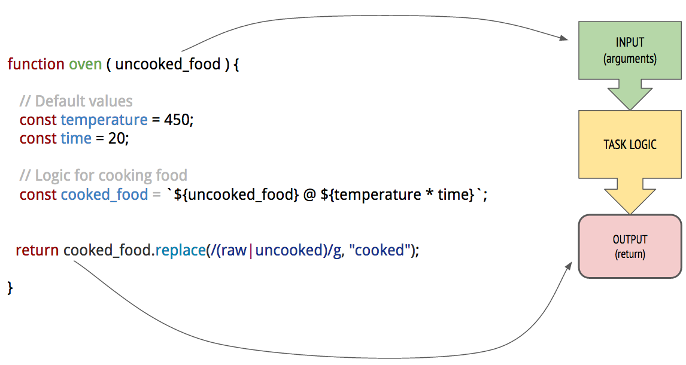
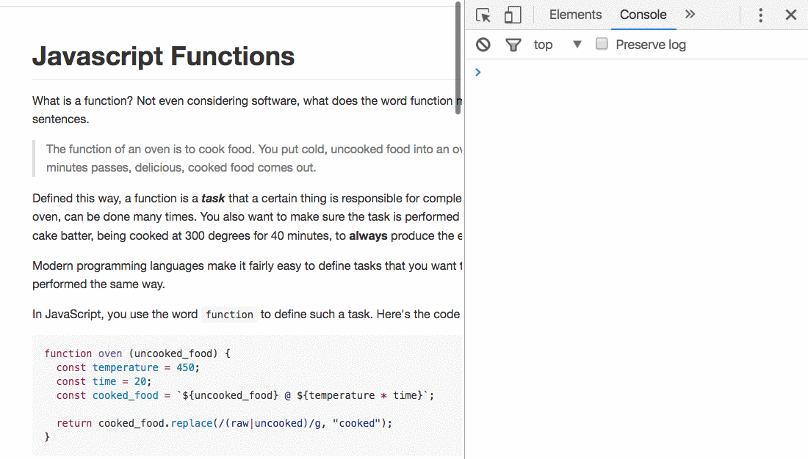

# Javascript Functions

What is a function? Not even considering software, what does the word function mean to you? Consider the following sentences.

> The function of an oven is to cook food. You put cold, uncooked food into an oven at 450 degrees, and after 20 minutes passes, delicious, cooked food comes out.

Defined this way, a function is a _**task**_ that a certain thing is responsible for completing. The task, such as cooking food in an oven, can be done many times. You also want to make sure the task is performed with consistency. You certainly expect cake batter, being cooked at 300 degrees for 40 minutes, to **always** produce the exact same result.

Modern programming languages make it fairly easy to define tasks that you want to repeat many times, and always be performed the same way. 

In JavaScript, you use the word `function` to define such a task. Here's the code for an oven function.

```js
function oven (uncooked_food) {
  const temperature = 450;
  const time = 20;
  const cooked_food = `${uncooked_food} @ ${temperature * time}`;

  return cooked_food.replace(/(raw|uncooked)/g, "cooked");
}
```

Now that you've defined an oven function, each time you invoke it, you know that the exact same series of instructions will be performed. This is one of the simplest ways to reduce errors when you are coding software applications. If you wanted to cook something 10 times in your application, and wrote the code over and over again each time, you've now greatly increased the chances that one of them will be typed incorrectly and your application won't work correctly.

At this point, we have a design for an oven. The next step is to actually *use* the oven. To use a JavaScript function, you simply type its name followed by parenthesis.

```js
oven();
```

This is called invoking the function.

Now, let's put uncooked food into the oven by passing a string value into it.

```js
oven("raw fish");
```

By putting the string of "raw fish" into the oven function, the `uncooked_food` argument that we defined in the parenthesis after the function name now has a value. Arguments are a mechanism that allow you to pass information to a function - like putting food into the oven. Without that input, nothing useful will happen.

### Function Return Values

The last part of the process is to take out the cooked food. Since the function used the `return` statement, we can store that returned value in a variable. It's the `return` keyword that determines what comes out of a function. More specifically, it determines what the JavaScript engine gives as the evaluation of the function execution.

If a function doesn't have a `return` statement, when the JavaScript engine attempts to evaluate it, it will be `undefined`.

```js
function complex_task () {
  const fun_variable = 1;
  const important_variable = true;
  const duck_variable = "quack";
  /*
    Imagine a world in which there is incredibly
    well-written, complex JavaScript code here.

    Notice the lack of `return` statement.
   */
}

let evaluated_value = complex_task();
console.log(evaluated_value) // undefined
```



Back to the oven. Let's take our cooked fish out of the oven. This works because in the function, we returned the variable that holds that value.

```js
/*
  The `cooked_fish` variable will have the value 
  of what was returned from the function
*/
const cooked_fish = oven("raw fish");
console.log(cooked_fish); // cooked fish @ 9000
```

You can try this out in Chrome. Press `Alt+Cmd+I` to open the Chrome development tools. At the top, click the section titled *Console*. Copy the `oven` function into the console, then press `Return`.

Next, paste the following code, change the food to whatever you want.

```js
const cooked_fish = oven("some other food");
```

Then type `cooked_fish` to see what its value is.



Again, the task that you defined in the function can now be performed as many times as you want, based on the needs of your application.

```js
// Cook dinner
const cooked_chicken = oven("raw chicken");
const roasted_broccoli = oven("raw broccoli");

// Bake dessert
const baked_cake = oven("uncooked cake batter");
```

### Function Side-Effects

Let's look at an example of a function that simply performs a specific task, by interacting with the browser DOM, and ends.

```js
// This function adds any series of character to the browser page.
function update_dom (content) {
  document.write(content);
}

update_dom("Is a pair of docks a paradox?");
```

That's a perfectly fine JavaScript function. In a more complicated JavaScript application, like the ones you will be building in groups here at NSS, you will build functions that perform a complex task so that you don't have duplicated code through your project.

What the function does have is a side effect, because its logic affects the DOM rather than just producing a consistent return value each time it is called. Therefore, it's not a [pure function](#pure-functions).

# Higher Order Functions

Functions that operate on *other* functions, either by taking them as arguments or by returning them, are called **higher-order functions**.

Since functions are objects (_remember, if it's not a native type, it's an object in JavaScript_), you can pass them as arguments to other function, just like you would any other JavaScript type. In the previous example for our `oven`, we passed a string value into the over, and got a string value back out of the oven.

There's more to a meal than cooking the food in an oven. We first need to prepare the meal, and after it is cooked, we need to serve it. We also need to decide if the dish is going to be baked or broiled.

Let's define a function for each purpose.

```js
/* 
  The ellipses (...) will take all arguments and make 
  an array out of them, stored in the ingredients argument.

  It's called the spread operator.
  https://developer.mozilla.org/en-US/docs/Web/JavaScript/Reference/Operators/Spread_operator
*/
function prepare_food (...ingredients) {
  const chopped = ingredients.map(ingredient => {
    return `10 slices of ${ingredient}`;
  });

  return chopped;
}

function bake (raw_dish) {
  return `Baked [${raw_dish}]`;
}

function broil (raw_dish) {
  return `Broiled [${raw_dish}]`;
}

/* 
  The `type_of_cooking` argument will hold a function
  reference. This makes `cook_food` a higher-order
  function.
*/
function cook_food (raw_dish, type_of_cooking) {
  // We invoke the specific cooking function here
  const result_of_cooking = type_of_cooking(raw_dish);
  return result_of_cooking;
}

function serve_food (cooked_dish, container) {
  return `A ${container} of ${cooked_dish} is on the table`;
}

// Prepare the ingredients
let raw_dish = prepare_food("onion", "carrot", "zucchini");

// Cook the raw ingredients
let cooked = cook_food(raw_dish, bake);

// Serve the cooked dish in a container of your choosing
let menu_item = serve_food(cooked, "platter");
```

## Pure Functions

> In computer programming, a function may be considered a pure function if both of the following statements about the function hold:
> 
> 1. The function always evaluates the same result value given the same argument value(s). The function result value cannot depend on any hidden information or state that may change while program execution proceeds or between different executions of the program, nor can it depend on any external input from I/O devices (usually—see below).
> 2. Evaluation of the result does not cause any semantically observable side effect or output, such as mutation of mutable objects or output to I/O devices.
>
> Source: [Wikipedia](https://en.wikipedia.org/wiki/Pure_function)

```js
// Pure function
function add (first, second) {
  return first + second;
}

// Impure function
function dice_roll (sides) {
  return Math.floor(Math.random() * sides) + 1;
}

// Pure function
function full_name (first_name, last_name) {
  return `${first_name} ${last_name}`;
}

// Impure function
function update_dom (dom_element, content) {
  dom_element.innerHTML = dom_element.innerHTML + content;
}
```

# Practice

Time for you to practice writing some functions. You will be creating some functions to be used by an art factory to produce either a wood carving, an oil painting, or stitched embroidery. Each function will be a [pure function](#pure-functions).

## Setup

1. Create a new directory in your workspace directory with the `mkdir` command..

    `~/workspace/functions/01-art-factory`
1. `cd` to that new directory.
1. Create an `index.html` file and a `artstore.js` file using the `touch` command.
1. Open the directory in your favorite editor.
1. Put boilerplate HTML in the `index.html` file.
1. Before the ending `body` tag, link in the `artstore.js` file with a `script` tag.
1. Inside the `body` tag, create a `div` element with the id of `outcomes`.
1. In `artstore.js` file, define four functions named, **buy**, **carve**, **paint**, and **stitch**.
1. Start your web server.
1. Open `localhost:8080` in your browser.

## Task

1. Define two arguments for the `buy` function.
    1. The first argument will be the theme for a piece of art (e.g. flower, mountain, dolphin).
    1. The second argument will be the material.
1. Define one argument for each of the `carve`, `paint`, and `stitch` methods. This argument will hold the theme of the art piece.
1. Invoke the `buy` function, and define a value for each of the arguments. For example: `buy('tree', 'canvas')`
1. Write logic in the `buy` function that specifies which other function should be invoked if the `material` variable holds the value of "wood", "canvas", or "cloth". Make sure you pass the material value, as an argument, to the appropriate function.
1. The `carve`, `paint`, and `stitch` functions should each return a string in the format "a *{action} {theme}*". For example, if the `carve` function's theme argument value was "sailing boat", then  the function would return "a carved sailing boat".
1. In the `buy` function, take the return value of the action function that was invoked and store it in a variable.
1. Next, append the material - that was passed as an argument - to the value of the variable you created in the previous step.
1. Then return that string. Building on the example in the previous step, the `buy` function would return the value "a carved sailing boat made of wood".
1. Write that output into the `outcomes` element in the browser DOM.

```js
function buy (theme, material) {
  /*
    Write an if..else block of code here that invokes 
    the correct method that creates the work of art
  */

  return something; // Replace `something` with the correct output
}
```
